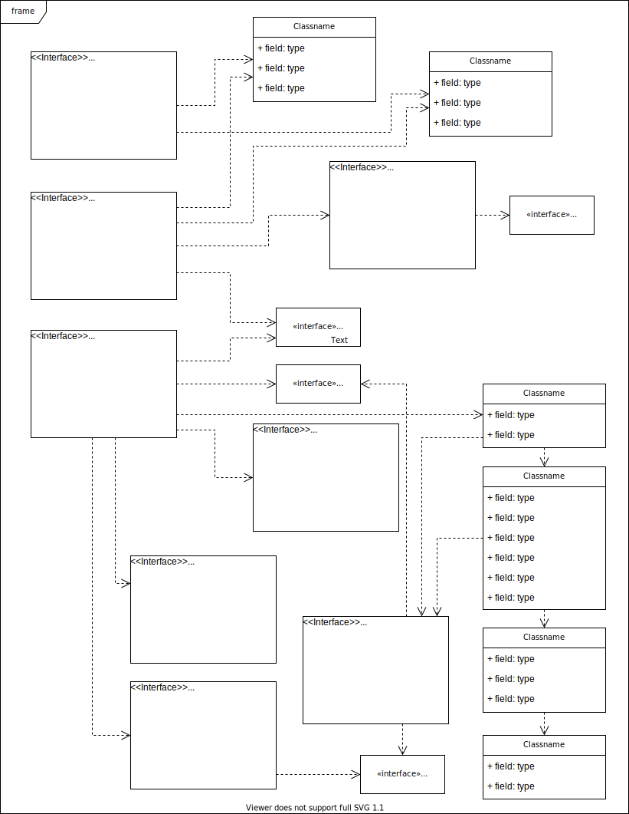

# hatsukoi
## 目录
- [hatsukoi是什么](#hatsukoi是什么？)
- [如何启动hatsukoi](#如何启动hatsukoi？)
- [hatsukoi的启动脚本](#hatsukoi的启动脚本)
## hatsukoi是什么
hatsukoi是一个类tomcat的web服务器+servlet容器
## 如何启动hatsukoi
### 预先步骤
在编译和启动hatsukoi前有几个预备步骤和配置文件需要知晓
1. 安装JDK (>=8)：设置环境变量JAVA_HOME为安装JDK的路径 [Oracle官网🔗](https://www.oracle.com/java/technologies/downloads/)
2. 安装Ant (>=1.9.5)：设置环境变量ANT_HOME为安装Ant的路径，并将ANT_HOME/bin加入环境变量PATH，这样ant命令行脚本就可以用来执行编译了
3. build.properties文件（可暂时忽略）：设置属性base.path为hatsukoi编译需要的依赖存放的路径
4. build.xml文件：Ant构建文件，定义了hatsukoi这个project的构建过程，默认任务为deploy，其中包含了很多target用来定义任务并且根据依赖顺序执行
    - 预编译（build-prepare）：在hatsukoi创建目录output/build和output/classes，build用来放置编译打包后的二进制文件，classes放置class文件
    - 编译（compile）：将java文件夹下所有java文件编译，结果class文件放到output/class
    - 打包（package）：将output/class内的class文件打包，放到output/build/中
    - 部署（deploy）：将bin/下的脚本复制到output/build/bin，并修改文件执行权限

### 编译构建项目
编译后，可执行的二进制文件被放置在了output目录下，根目录下其余文件为源码
```bash
$ cd ${hatsukoi.home}
$ ant
```
### 启动hatsukoi
通过startup.sh启动hatsukoi，启动后，hatsukoi就可以在[http://localhost:8080](http://localhost:8080/)访问了
```bash
$ cd ${hatsukoi.home}/output/build/bin
$ startup.sh start
```
## hatsukoi的启动脚本
1. bin/startup.sh：判断catalina.sh文件是否存在且可执行，并启动catalina.sh脚本并附带参数
1. bin/catalina.sh：设置CATALINA相关环境变量（CATALINA_HOME、CATALINA_BASE、CATALINA_OUT），设置CLASSPATH、JAVA_HOME、JRE_HOME、_RUNJAVA、_RUNJDB等环境变量，打印一些提示信息，start模式启动hatsukoi的启动类org.futurework.catalina.startup.Bootstrap，将输出log输出到CATALINA_OUT

<!--  -->